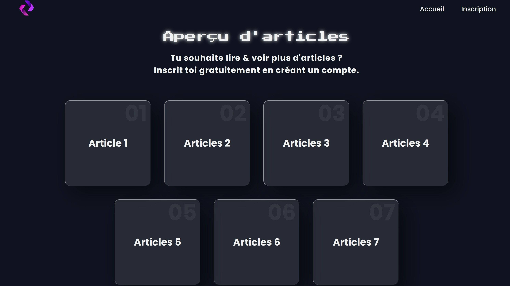

# PHP Blog Project 📝💻

> **This project was created as part of my training in the OpenClassrooms PHP/Symfony Developer track.**  
> --> *Version : [Français](README_fr.md)* 📖

## 📖 Description

**PHP Blog Project** is a simple **PHP** blog platform designed to allow a developer to showcase their talents and skills through a personalized blog.  
The website was developed from scratch, without relying on CMS like WordPress, to demonstrate my skills in PHP web development.



## 🚀 Features

- **Home page** : Includes developer information such as name, photo/logo, and a personal catchphrase.
- **Blog posts list** : Displays all blog posts, sorted from newest to oldest.
- **Detailed view for each post** : Each post includes a title, content, and updated date with a comment form.
- **CRUD operations** : Ability for the blogger to add, modify, and delete posts.
- **User authentication** : Includes login and registration pages.
- **Security enhancements** : Protects against common vulnerabilities such as XSS, CSRF, and SQL Injection.
- **Responsive design** : The site is fully styled with HTML/CSS, providing a modern, responsive presentation.

## 🚧 Installation

### Prerequisites

Before you begin, ensure you have the following installed :

- **PHP**
- **XAMPP** (for Apache and phpMyAdmin)
- **Git** (to clone the repository)

### Installation steps

1. **Clone the repository**  
   Use Git to clone the project :  
   ```sh
   git clone https://github.com/TolMen/OCProjet5.git
   ```
2. **Move the folder**  
   Move the cloned folder to the `htdocs` directory of XAMPP.

3. **Create the database**  
   Open phpMyAdmin and create a database for the project. <br>
   Make sure to create the necessary tables with the proper columns.

5. **Configure the database connection**  
   Edit the `configBDD` file to update the database connection settings with your own database credentials.

6. **Start XAMPP**  
   Launch the XAMPP Control Panel and start the **Apache** and **MySQL** modules. <br>
   Then click **Admin** to access phpMyAdmin.

## 💡 Improvements

This project serves as a basic PHP blog platform, but there are plenty of opportunities for improvement :

- ✅ Adding pagination to the list of posts.
- ✅ Implementing an image upload feature for blog posts.
- ✅ Adding a comment moderation system.
- ✅ Enhancing the security with further user role management.

---

Thank you for exploring this project.  
Feel free to explore, modify, and improve it ! ✨  

For any questions or collaboration, don’t hesitate to reach out ! 📩

[TolMen](https://github.com/TolMen) - [LinkedIn](https://www.linkedin.com/in/jessyfrachisse/)
