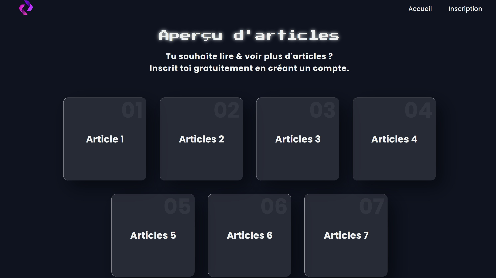

# PHP Blog Project 📝💻

> **Ce projet a été réalisé dans le cadre de mon apprentissage pour le parcours d'OpenClassrooms (Développeur d'application PHP/Symfony).**  
> --> *Version : [English](README.md)* 📖

## 📖 Description

**PHP Blog Project** est une plateforme de blog simple en **PHP**, conçue pour permettre à un développeur de présenter ses talents et compétences à travers un blog personnalisé.  
Le site a été développé de zéro, sans utiliser de CMS comme WordPress, pour démontrer mes compétences en développement web PHP.



## 🚀 Fonctionnalités

- **Page d'accueil** : Inclut les informations du développeur, telles que le nom, la photo/logo et une phrase accrocheuse.
- **Liste des articles** : Affiche tous les articles de blog, triés du plus récent au plus ancien.
- **Vue détaillée de chaque article** : Chaque article inclut un titre, du contenu, une date de mise à jour et un formulaire de commentaire.
- **Opérations CRUD** : Permet au blogueur d'ajouter, modifier et supprimer des articles.
- **Authentification des utilisateurs** : Pages de connexion et d'inscription incluses.
- **Améliorations de la sécurité** : Protection contre les vulnérabilités courantes telles que XSS, CSRF et injection SQL.
- **Design responsive** : Le site est entièrement stylisé avec du HTML/CSS, offrant une présentation moderne et réactive.

## 🚧 Installation

### Prérequis

Avant de commencer, assurez-vous d'avoir les éléments suivants installés sur votre machine :

- **PHP**
- **XAMPP** (pour Apache et phpMyAdmin)
- **Git** (pour cloner le dépôt)

### Étapes d'installation

1. **Cloner le dépôt**  
   Utilisez Git pour cloner le projet :  
   ```sh
   git clone https://github.com/TolMen/OCProjet5.git
   ```
2. **Déplacer le dossier**  
   Déplacez le dossier cloné dans le répertoire `htdocs` de XAMPP.

3. **Créer la base de données**  
   Ouvrez phpMyAdmin et créez une base de données pour le projet. <br>
   N'oubliez pas de créer les tables nécessaires avec les bonnes colonnes.

5. **Configurer la connexion à la base de données**  
   Modifiez le fichier `configBDD` pour mettre à jour les paramètres de connexion à la base de données avec vos propres identifiants.

6. **Lancer XAMPP**  
   Lancez le panneau de contrôle de XAMPP et démarrez les modules **Apache** et **MySQL**. <br>
   Ensuite, cliquez sur **Admin** pour accéder à phpMyAdmin.

---

Merci d'explorer ce projet.  
N'hésitez pas à l'explorer, le modifier et l'améliorer ! ✨  

**Pour toute question ou collaboration, n'hésitez pas à me contacter ! 📩**

[TolMen](https://github.com/TolMen) - [LinkedIn](https://www.linkedin.com/in/jessyfrachisse/)

